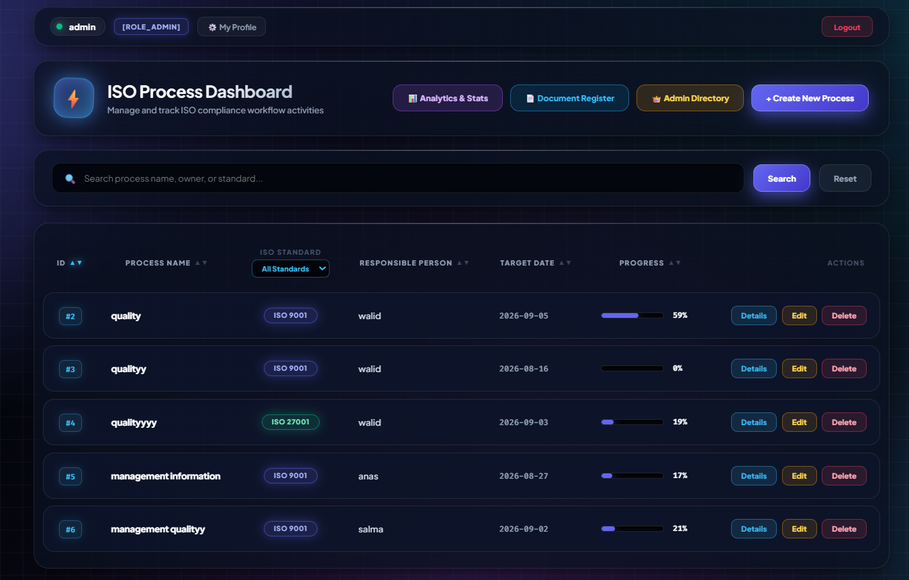
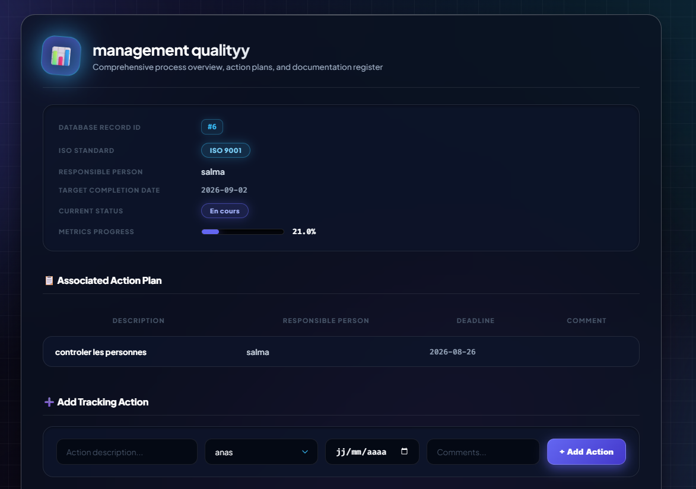
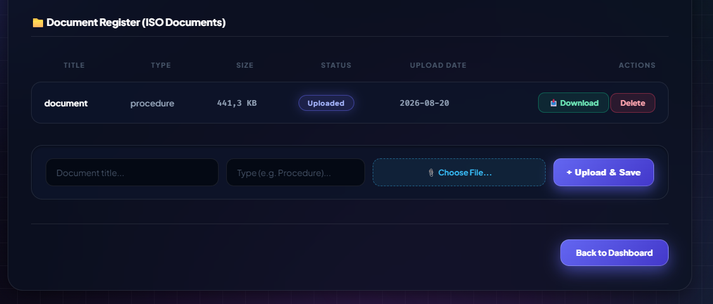

# 🛡️ ISO Progress Tracker

[](https://www.oracle.com/java/)
[](https://spring.io/projects/spring-boot)
[](https://spring.io/projects/spring-security)
[](https://www.thymeleaf.org/)
[](https://getbootstrap.com/)
[](https://www.h2database.com/)
[](https://www.gnu.org/licenses/gpl-3.0)

A centralized enterprise web application designed to track, coordinate, and audit compliance workflows for international standards:
* **ISO 9001:2015** (Quality Management Systems)
* **ISO/IEC 27001:2022** (Information Security Management Systems)

Engineered using the **2TUP (Two Tracks Unified Process)** methodology with a 3-tier monolithic Model-View-Controller (MVC) architecture.

---

## 📖 Project Overview

Continuous audit readiness is critical for modern organizations, yet compliance management often suffers from fragmented spreadsheets, scattered email threads, and untracked file attachments.

**ISO Progress Tracker** addresses these operational risks by providing a unified, secure workspace that centralizes process ownership, corrective action tracking, and audit artifact verification. The platform streamlines audit preparation, automates metric computation, and guarantees end-to-end accountability across organizational departments.

---

## 📸 Application Preview

| Normative Process Portfolio | Real-Time Analytics Dashboard |
| :---: | :---: |
|  |  |

| Corrective Action Plans (CAPA) | Audit Evidence Vault |
| :---: | :---: |
|  |  |

---

## 🌟 Key Functional Modules

* **Normative Process Portfolio:** Complete lifecycle management (CRUD) for ISO 9001 and ISO 27001 processes. Features multi-criteria keyword search, standard-specific filtering, and dynamic multi-column sorting (by Name, Responsible Pilot, Target Date, and Progress).
* **Corrective Action Plans (CAPA):** Contextual mitigation tracking linked directly to parent processes with cascading integrity. Tracks operational deadlines and strict execution statuses (`EN COURS`, `TERMINÉ`).
* **Centralized Audit Evidence Vault:** Secure document repository managing file uploads, duplicate title prevention, metadata indexing (file size, MIME type, upload timestamp), and direct byte-stream downloading.
* **In-Memory Analytics Dashboard (`/stats`):** Real-time executive metrics computed via the **Java Streams API**, including overall compliance percentages, pilot workload rankings, standard distributions, and process health indicators without heavy SQL aggregate overhead.
* **Role-Based Access Control (RBAC):** Tiered operational permissions (`ROLE_ADMIN` vs. `ROLE_USER`) secured with **Spring Security 6**, BCrypt password hashing, and active CSRF mitigation.
* **Security Interceptors & Workflow Governance:** 
  * Custom `ForcePasswordChangeInterceptor` blocking platform access until temporary or reset credentials are changed via `force-change-password.html`.
  * Self-registration gate holding unapproved accounts in a pending state (`approved = false`) until validated by an administrator.
  * User management portal for administrators to review accounts, process password recovery tickets, and edit permissions.

---

## 🏛️ System Architecture

The application adopts an enterprise 3-tier monolithic architecture ensuring strict separation of presentation, security, business computation, and data persistence:

```text
┌────────────────────────────────────────────────────────────────────────┐
│               PRESENTATION LAYER (Client Browser & UI)                 │
│  - Thymeleaf 3 Template Engine + Spring Security Dialect               │
│  - Responsive Bootstrap 5 Layouts (Dark/Light Contextual Elements)     │
│  - Contextual Views (processes/, admin-users, profile, auth portals)   │
└───────────────────────────────────┬────────────────────────────────────┘
                                    │ HTTP(S) Form / Multi-part Requests
                                    ▼
┌────────────────────────────────────────────────────────────────────────┐
│             WEB CONTROLLERS & APPLICATION SECURITY LAYER               │
│  - Spring MVC Web Controllers (@Controller)                            │
│  - Spring Security 6 Filter Chain (BCrypt, CSRF prevention, Sessions)  │
│  - Custom HandlerInterceptor (ForcePasswordChangeInterceptor)          │
│  - Role-Based Route Authorization (ROLE_ADMIN vs. ROLE_USER)           │
└───────────────────────────────────┬────────────────────────────────────┘
                                    │ Service Invocations
                                    ▼
┌────────────────────────────────────────────────────────────────────────┐
│                 BUSINESS LOGIC & COMPUTATION LAYER                     │
│  - Spring @Service Domain Implementations                              │
│  - Java Streams API Pipeline (In-Memory KPIs, Rankings, Aggregations)  │
│  - Multi-Criteria Filtering & Bidirectional Sorting Algorithms         │
│  - Local Filesystem Storage Synchronization (Audit Evidence Files)     │
└───────────────────────────────────┬────────────────────────────────────┘
                                    │ Spring Data Repositories
                                    ▼
┌────────────────────────────────────────────────────────────────────────┐
│             PERSISTENCE & DATA STORAGE LAYER                           │
│  - Spring Data JPA & Hibernate ORM 6                                   │
│  - Relational Mapping (@Entity, CascadeType.ALL, OrphanRemoval)        │
│  - Embedded H2 Database (Persistent File Mode + AUTO_SERVER=TRUE)      │
│  - File System Evidence Vault (uploads/iso_docs/)                      │
└────────────────────────────────────────────────────────────────────────┘

```

---

## 🛠️ Technology Stack

| Layer / Concern | Technology | Version | Architectural Rationale |
| --- | --- | --- | --- |
| **Runtime Environment** | **Java SE (JDK)** | 17 LTS | Modern LTS enterprise standard featuring Records, Text Blocks, and enhanced Streams API. |
| **Framework Engine** | **Spring Boot** | 3.2.5 | Rapid configuration, IoC container, embedded Tomcat 10, and modern Spring 6 ecosystem. |
| **Security Framework** | **Spring Security** | 6.2.4 | Route protection, cryptographic BCrypt password hashing, session management, and RBAC. |
| **Data Access & ORM** | **Spring Data JPA / Hibernate** | 6.4.4 | Declarative repositories, transactional boundary control, and object-relational mapping. |
| **Database Engine** | **H2 Database Engine** | 2.2.224 | Zero-dependency file-based storage with `AUTO_SERVER=TRUE` mixed-mode access. |
| **Template Engine** | **Thymeleaf** | 3.1.2 | Natural server-side HTML rendering integrated with Spring Security tag libraries. |
| **Frontend UI** | **Bootstrap** | 5.3 | Responsive grid layout, utility classes, and consistent operational UI components. |
| **Build & Lifecycle** | **Apache Maven** | 3.8+ | Standardized dependency management, reproducible builds, and executable JAR packaging. |
| **Methodology** | **2TUP & UML** | — | Two Tracks Unified Process combining functional and technical specifications via PlantUML. |

---

## 📂 Project Structure

```text
iso-progress-tracker/
├── .mvn/wrapper/                                   # Maven Wrapper binaries and configuration
├── docs/screenshots/                              # UI preview captures and documentation graphics
├── src/
│   ├── main/
│   │   ├── java/com/iso_progress_tracker/
│   │   │   ├── config/
│   │   │   │   ├── AppConfig.java                  # Global application beans & configurations
│   │   │   │   ├── DataInitializer.java            # Seed accounts, normative standards, and initial data
│   │   │   │   ├── ForcePasswordChangeInterceptor.java # Mandatory password reset enforcement filter
│   │   │   │   ├── SecurityConfig.java             # SecurityFilterChain, RBAC permissions, and CSRF policy
│   │   │   │   └── WebMvcConfig.java               # Interceptor registries and custom resource handlers
│   │   │   ├── controllers/
│   │   │   │   ├── ActionController.java           # CAPA action creation, status updates, and deletion
│   │   │   │   ├── AdminController.java            # User approvals, role assignments, and password resets
│   │   │   │   ├── AuthController.java             # Login, registration, and password recovery workflows
│   │   │   │   ├── DocumentController.java         # Evidence file upload, metadata parsing, and download streaming
│   │   │   │   ├── ProcessController.java          # Process inventory CRUD, filtering, and sorting
│   │   │   │   ├── ProfileController.java          # User profile view and personal credential updates
│   │   │   │   └── StatsController.java            # Java Streams analytics metrics and dashboard rendering
│   │   │   ├── dto/
│   │   │   │   └── PasswordChangeForm.java         # Form backing object for password modification
│   │   │   ├── entities/
│   │   │   │   ├── Action.java                     # CAPA task entity (@ManyToOne parent linkage)
│   │   │   │   ├── Document.java                   # Audit evidence metadata and file pointer entity
│   │   │   │   ├── Process.java                    # Normative ISO process root entity
│   │   │   │   ├── Role.java                       # Enumeration of application authorities (ROLE_ADMIN, ROLE_USER)
│   │   │   │   └── User.java                       # User entity with security flags and approval states
│   │   │   ├── repositories/
│   │   │   │   ├── ActionRepository.java           # JPA repository for corrective actions
│   │   │   │   ├── DocumentRepository.java         # JPA repository for evidence records
│   │   │   │   ├── ProcessRepository.java          # JPA repository with search queries for processes
│   │   │   │   └── UserRepository.java             # JPA repository for user credentials and lookups
│   │   │   ├── services/
│   │   │   │   ├── ActionService.java              # Business validation and lifecycle logic for actions
│   │   │   │   ├── CustomUserDetailsService.java   # Spring Security UserDetails loading implementation
│   │   │   │   ├── DocumentService.java            # Disk I/O storage synchronization and stream retrieval
│   │   │   │   ├── ProcessService.java             # Sorting, filtering, and process coordination
│   │   │   │   └── UserService.java                # Account registration, approval gates, and password hashing
│   │   │   └── IsoProgressTrackerApplication.java  # Spring Boot main class bootstrap
│   │   └── resources/
│   │       ├── templates/
│   │       │   ├── processes/
│   │       │   │   ├── add.html                    # Create new ISO process view
│   │       │   │   ├── details.html                # Process overview, attached CAPAs, and metrics
│   │       │   │   ├── documents.html              # Process audit evidence vault view
│   │       │   │   ├── edit.html                   # Update process metadata view
│   │       │   │   ├── list.html                   # Process list with search, filters, and sort options
│   │       │   │   └── stats.html                  # In-memory Java Streams statistical dashboard
│   │       │   ├── admin-edit-user.html            # Administrative user modification template
│   │       │   ├── admin-users.html                # Administrator user management and approval table
│   │       │   ├── check-reset-status.html         # Status checker for submitted password recovery
│   │       │   ├── force-change-password.html      # Mandatory password reset prompt screen
│   │       │   ├── forgot-password.html            # Password recovery ticket submission form
│   │       │   ├── login.html                      # System authentication portal
│   │       │   ├── password-reset-pending.html     # Confirmation view after requesting a reset
│   │       │   ├── pending-approval.html           # Awaiting administrator approval gate view
│   │       │   ├── profile.html                    # User profile and password management
│   │       │   └── register.html                   # Account registration portal
│   │       └── application.properties              # DataSource, JPA dialect, and file upload parameters
├── .gitattributes                                  # Git line-ending normalization rules
├── .gitignore                                      # Exclusions for target/, .idea/, and persistent data/
├── LICENSE                                         # GNU General Public License v3.0
├── pom.xml                                         # Maven project definition and dependency manifest
└── README.md                                       # Comprehensive project documentation

```

---

## ⚙️ Configuration Details (`application.properties`)

The core configuration establishes persistent file-mode storage for the embedded H2 engine and configures maximum upload limits for compliance artifacts:

```properties
# Spring Datasource (H2 Persistent File Mode)
spring.datasource.url=jdbc:h2:file:./data/isotrackerdb;AUTO_SERVER=TRUE
spring.datasource.driverClassName=org.h2.Driver
spring.datasource.username=sa
spring.datasource.password=

# JPA & Hibernate Settings
spring.jpa.database-platform=org.hibernate.dialect.H2Dialect
spring.jpa.hibernate.ddl-auto=update
spring.jpa.show-sql=false

# H2 Console (Development & Database Inspection)
spring.h2.console.enabled=true
spring.h2.console.path=/h2-console

# Multipart File Upload Limits (Audit Evidence Vault)
spring.servlet.multipart.max-file-size=10MB
spring.servlet.multipart.max-request-size=10MB

```

---

## 🚀 Getting Started

### Prerequisites

* **Java Development Kit (JDK):** Version 17 LTS or higher
* **Apache Maven:** Version 3.8+ (or use the included `./mvnw` wrapper)
* **Git:** For repository cloning and revision tracking
* Modern Web Browser (Google Chrome, Mozilla Firefox, Microsoft Edge)

### Installation & Local Execution

1. **Clone the repository:**
```bash
git clone [https://github.com/Anasfdch5/iso-progress-tracker.git](https://github.com/Anasfdch5/iso-progress-tracker.git)
cd iso-progress-tracker

```


2. **Build and package the application:**
```bash
mvn clean install

```


3. **Launch the Spring Boot server:**
```bash
mvn spring-boot:run

```


4. **Access the application:**
* **Web Portal:** Open your browser and navigate to `http://localhost:8080/login`
* **Initial Admin Credentials:** Configured via `DataInitializer.java`
* **Embedded H2 Web Console:** `http://localhost:8080/h2-console`
* **JDBC URL:** `jdbc:h2:file:./data/isotrackerdb;AUTO_SERVER=TRUE`
* **User Name:** `sa`
* **Password:** *(leave empty)*


---

## 🔒 Security Architecture Highlights

* **Role-Based Authorization:** Endpoints under `/admin/**` require `ROLE_ADMIN` authority, while standard business operations are accessible to verified users holding `ROLE_USER`.
* **Interceptor Enforcement:** The `ForcePasswordChangeInterceptor` verifies authentication states on every request, redirecting flagged accounts directly to `/force-change-password` before enabling normal navigation.
* **Registration Gating:** New accounts are initialized with `approved = false`. The authentication provider prevents login until an administrator explicitly reviews and validates the account in the admin dashboard.
* **File Upload Security:** Uploaded files in `DocumentService` are sanitized, verified against duplicate identifiers, and served through a controlled byte-stream endpoint that prevents arbitrary path traversal.

---

## 📄 License

This project is licensed under the **GNU General Public License v3.0** — see the [LICENSE](https://github.com/Anasfdch5/iso-progress-tracker/blob/main/LICENSE) file for complete terms and copyleft permissions.

---

## 👤 Author

* **Anas Fdaouch** — Software Engineering Student at École Nationale des Sciences Appliquées d'Agadir (ENSA-A)
* **Email:** anasfdaouch5@gmail.com
* **GitHub:** [github.com/Anasfdch5](https://github.com/Anasfdch5)
* **LinkedIn:** [linkedin.com/in/anas-fdaouch](https://www.linkedin.com/in/anas-fdaouch/)


```

```
